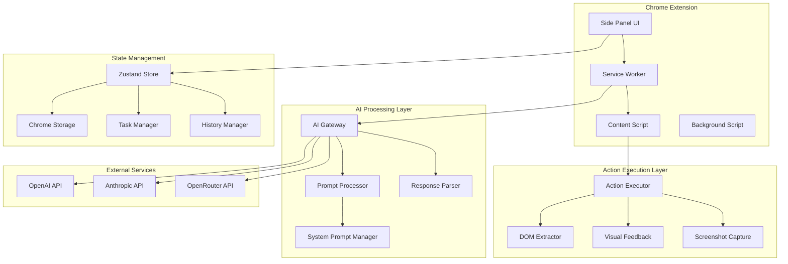

# Design Document

## Overview

Superwizard AI is a sophisticated Chrome extension that bridges natural language understanding with precise web automation. The system operates through a multi-layered architecture that captures page state, processes user intent through AI, and executes browser actions with visual feedback. The design emphasizes reliability, security, and user experience while handling the complexity of modern web applications.

The core innovation lies in the AI-driven action planning system that analyzes DOM structure, maintains conversation context, and generates precise browser automation commands. The system uses a content script injection model for DOM manipulation, a service worker for background processing, and a React-based side panel for user interaction.

## Architecture

### System Components Overview



### Core Architecture Principles

1. **Separation of Concerns**: UI, AI processing, and DOM manipulation are isolated
2. **Event-Driven Communication**: Components communicate through Chrome extension messaging
3. **State Persistence**: Critical state persists across browser sessions
4. **Error Isolation**: Failures in one component don't cascade to others
5. **Security First**: No external data transmission except to configured AI APIs

## Components and Interfaces

### 1. AI Processing System

#### AI Gateway (`src/wizardry/ai/terminalGateway.ts`)

The AI Gateway serves as the unified interface for all AI provider interactions, handling authentication, request formatting, and response processing.

**Core Functionality:**
```typescript
interface AIGateway {
  determineNextAction(
    taskInstructions: string,
    previousActions: ActionHistory[],
    simplifiedDOM: string,
    context?: string,
    screenshotDataUrl?: string,
    fullPrompt?: string
  ): Promise<ActionResponse | null>
}
```

**Provider Abstraction:**
- **OpenAI Integration**: Uses chat completions API with GPT-4/3.5-turbo models
- **Anthropic Integration**: Uses messages API with Claude-3 models  
- **OpenRouter Integration**: Unified API for multiple model providers
- **Request Formatting**: Converts internal format to provider-specific schemas
- **Response Normalization**: Standardizes responses across different providers

**Error Handling Strategy:**
- Automatic retry with exponential backoff
- Provider failover for redundancy
- Rate limit detection and queuing
- Network timeout management
- API key validation and rotation

#### Prompt Engineering System (`src/wizardry/ai/formatPrompt.ts`)

The prompt system constructs sophisticated prompts that enable reliable automation through structured reasoning.

**Prompt Components:**
1. **System Instructions**: Core automation rules and available actions
2. **Current DOM State**: Simplified page structure with element IDs
3. **Action History**: Previous steps with success/failure context
4. **Task Context**: User's original request and current progress
5. **Visual Context**: Optional screenshot data for vision-enabled models
6. **Validation Rules**: Success/failure indicators for progress tracking

**DOM Simplification Algorithm:**
```typescript
interface SimplifiedElement {
  id: number;
  tag: string;
  attributes: Record<string, string>;
  text?: string;
  children?: SimplifiedElement[];
}
```

The system removes non-interactive elements, assigns unique IDs, and preserves essential attributes for element targeting.

**Chain-of-Thought Prompting:**
The system enforces a specific reasoning pattern:
1. **Task Acknowledgment**: "The user asked me to do: [task]"
2. **Progress Analysis**: "Based on Current Actions History, I have done: [summary]"
3. **DOM State Evaluation**: "Now let me analyze the current DOM state..."
4. **Next Step Planning**: "Given the task and DOM state, I think I should..."
5. **Element Identification**: "Looking at current page contents, I can identify..."
6. **Memory Storage**: Optional context preservation for complex tasks

#### Response Parsing System (`src/wizardry/ai/parseResponse.ts`)

The parser extracts structured actions from AI responses using pattern matching and validation.

**Response Format Enforcement:**
```xml
<thought>Chain-of-thought reasoning following specific structure</thought>
<action>actionName(parameters)</action>
```

**Action Validation:**
- Parameter type checking (string, number, boolean)
- Element ID existence verification
- Action sequence logic validation
- Safety constraint enforcement

**Supported Actions:**
- `click(elementId)`: Click on specified element
- `setValue(elementId, text)`: Input text with keyboard simulation
- `navigate(url)`: Navigate to specified URL
- `waiting(seconds)`: Pause execution for dynamic content
- `finish()`: Mark task as successfully completed
- `fail(message)`: Report task failure with reason
- `respond(message)`: Send message to user for clarification

### 2. DOM Interaction System

#### Element Identification Strategy

The system uses a multi-layered approach for reliable element targeting:

**Primary Method - Data-ID Assignment:**
```typescript
function assignDataIds(element: Element, counter: { value: number }): void {
  if (isInteractiveElement(element)) {
    element.setAttribute('data-superwizard-id', counter.value.toString());
    counter.value++;
  }
  
  Array.from(element.children).forEach(child => 
    assignDataIds(child, counter)
  );
}
```

**Interactive Element Detection:**
- Form inputs (input, textarea, select)
- Clickable elements (button, a, [role="button"])
- Interactive ARIA elements ([role="tab"], [role="menuitem"])
- Custom interactive elements with event listeners

**Fallback Identification Methods:**
1. **ARIA Labels**: `aria-label`, `aria-labelledby` attributes
2. **Text Content**: Visible text for buttons and links
3. **Semantic Attributes**: `placeholder`, `title`, `alt` attributes
4. **Structural Context**: Parent-child relationships for disambiguation

#### Action Execution Engine (`src/wizardry/operation/index.ts`)

The action executor handles the translation of high-level commands into precise DOM manipulations.

**Click Action Implementation:**
```typescript
async function executeClick(elementId: number): Promise<ActionResult> {
  const element = findElementByDataId(elementId);
  if (!element) return { success: false, error: 'Element not found' };
  
  // Ensure element is visible and interactable
  await ensureElementVisibility(element);
  await waitForElementStability(element);
  
  // Simulate human-like interaction
  const rect = element.getBoundingClientRect();
  const centerX = rect.left + rect.width / 2;
  const centerY = rect.top + rect.height / 2;
  
  // Dispatch events in proper sequence
  element.dispatchEvent(new MouseEvent('mousedown', { 
    bubbles: true, 
    clientX: centerX, 
    clientY: centerY 
  }));
  
  element.dispatchEvent(new MouseEvent('mouseup', { 
    bubbles: true, 
    clientX: centerX, 
    clientY: centerY 
  }));
  
  element.dispatchEvent(new MouseEvent('click', { 
    bubbles: true, 
    clientX: centerX, 
    clientY: centerY 
  }));
  
  return { success: true };
}
```

**Text Input Implementation:**
```typescript
async function executeSetValue(elementId: number, text: string): Promise<ActionResult> {
  const element = findElementByDataId(elementId) as HTMLInputElement;
  if (!element) return { success: false, error: 'Element not found' };
  
  // Focus the element
  element.focus();
  
  // Clear existing content
  element.select();
  
  // Process special characters
  const processedText = text
    .replace(/\\n/g, '\n')  // Enter key
    .replace(/\\r/g, '\r'); // Newline character
  
  // Simulate typing with proper events
  for (const char of processedText) {
    if (char === '\n') {
      // Trigger form submission or search
      element.dispatchEvent(new KeyboardEvent('keydown', { 
        key: 'Enter', 
        bubbles: true 
      }));
    } else {
      // Regular character input
      element.value += char;
      element.dispatchEvent(new Event('input', { bubbles: true }));
    }
  }
  
  return { success: true };
}
```

#### Page Stability Management

The system ensures page readiness before executing actions:

**Stability Checks:**
1. **DOM Ready State**: Document loading completion
2. **Network Activity**: No pending XHR/fetch requests
3. **Animation Completion**: CSS transitions and animations finished
4. **Element Visibility**: Target elements are rendered and visible
5. **JavaScript Execution**: No active setTimeout/setInterval operations

**Implementation:**
```typescript
async function ensurePageStability(tabId: number): Promise<void> {
  return new Promise((resolve) => {
    const checkStability = () => {
      chrome.scripting.executeScript({
        target: { tabId },
        func: () => {
          // Check document ready state
          if (document.readyState !== 'complete') return false;
          
          // Check for active network requests
          if (window.performance.getEntriesByType('navigation')[0]?.loadEventEnd === 0) {
            return false;
          }
          
          // Check for running animations
          const animations = document.getAnimations();
          if (animations.some(anim => anim.playState === 'running')) {
            return false;
          }
          
          return true;
        }
      }, (results) => {
        if (results[0]?.result) {
          resolve();
        } else {
          setTimeout(checkStability, 100);
        }
      });
    };
    
    checkStability();
  });
}
```

### 3. Visual Feedback System

#### Custom Cursor Implementation (`src/pages/Content/cursor.ts`)

The visual feedback system provides real-time indication of AI actions through a custom cursor overlay.

**Cursor States:**
- **Idle**: Default state when no action is executing
- **Targeting**: Highlighting the element about to be interacted with
- **Clicking**: Animation during click execution
- **Typing**: Indication during text input
- **Waiting**: Visual feedback during delays
- **Error**: Red indicator for failed actions

**Implementation:**
```typescript
class SuperwizardCursor {
  private cursorElement: HTMLElement;
  private targetElement: HTMLElement | null = null;
  
  constructor() {
    this.cursorElement = this.createCursorElement();
    document.body.appendChild(this.cursorElement);
  }
  
  showTargeting(element: HTMLElement): void {
    this.targetElement = element;
    const rect = element.getBoundingClientRect();
    
    this.cursorElement.style.left = `${rect.left + rect.width / 2}px`;
    this.cursorElement.style.top = `${rect.top + rect.height / 2}px`;
    this.cursorElement.className = 'superwizard-cursor targeting';
    
    // Add pulsing animation
    this.cursorElement.style.animation = 'pulse 1s infinite';
  }
  
  showClicking(): void {
    this.cursorElement.className = 'superwizard-cursor clicking';
    this.cursorElement.style.animation = 'click-animation 0.3s ease-out';
  }
  
  hide(): void {
    this.cursorElement.style.display = 'none';
  }
}
```

#### Screenshot Capture System (`src/wizardry/extraction/captureScreenshot.ts`)

The screenshot system provides visual context to AI models for enhanced decision-making.

**Capture Process:**
1. **Tab Activation**: Ensure target tab is active and visible
2. **Viewport Optimization**: Scroll to show relevant content
3. **Element Highlighting**: Optionally highlight interactive elements
4. **Image Capture**: Use Chrome's captureVisibleTab API
5. **Data Processing**: Convert to base64 for AI transmission

**Implementation:**
```typescript
async function captureScreenshot(tabId: number): Promise<{ dataUrl: string }> {
  // Activate the target tab
  await chrome.tabs.update(tabId, { active: true });
  
  // Wait for tab to be fully loaded
  await ensurePageStability(tabId);
  
  // Capture the visible area
  const dataUrl = await chrome.tabs.captureVisibleTab(
    undefined, 
    { format: 'png', quality: 90 }
  );
  
  return { dataUrl };
}
```

### 4. State Management Architecture

#### Zustand Store Configuration (`src/state/index.ts`)

The state management system uses Zustand with persistence and immutability for reliable state handling.

**Store Structure:**
```typescript
interface AppState {
  taskManager: TaskManagerSlice;
  settings: SettingsSlice;
  storage: StorageSlice;
}

const useAppState = create<AppState>()(
  persist(
    immer(
      devtools((...args) => ({
        taskManager: createTaskManagerSlice(...args),
        settings: createSettingsSlice(...args),
        storage: createStorageSlice(...args),
      }))
    ),
    {
      name: 'superwizard-state',
      storage: createJSONStorage(() => chromeStorage),
      partialize: (state) => ({
        settings: state.settings,
        storage: state.storage,
        // Exclude taskManager from persistence (runtime only)
      }),
    }
  )
);
```

#### Task Manager Implementation (`src/state/TaskManager.ts`)

The task manager orchestrates the entire automation workflow from command input to completion.

**Execution Flow:**
1. **Task Initialization**: Parse user command and setup progress tracking
2. **DOM Analysis**: Extract and simplify current page structure
3. **AI Processing**: Generate next action based on context and DOM
4. **Action Execution**: Perform the determined action with error handling
5. **Progress Validation**: Verify action success and update progress
6. **Loop Continuation**: Repeat until task completion or failure

**Key Methods:**
```typescript
interface TaskManager {
  runTask(onError?: (error: string) => void): Promise<void>;
  updateTaskProgress(progress: Partial<TaskProgress>): void;
  validateAction(actionType: string, result: any): 'success' | 'pending' | 'failure';
  interrupt(): Promise<void>;
  clearHistory(): void;
}
```

**Error Recovery Strategy:**
- **Consecutive Failure Tracking**: Stop after 3 consecutive failures
- **Action Rollback**: Undo actions when possible
- **State Preservation**: Maintain conversation history through errors
- **User Notification**: Clear error reporting with recovery suggestions

## Data Models

### Action History Model

```typescript
interface TaskHistoryEntry {
  prompt: string;                    // Original user command
  context?: string;                  // Full AI prompt context
  content: string;                   // AI response content
  role: 'user' | 'ai' | 'error';   // Message type
  action: {                         // Parsed action details
    name: string;
    args: Record<string, any>;
  } | null;
  usage: any;                       // AI API usage statistics
  timestamp: string;                // ISO timestamp
  screenshotDataUrl?: string;       // Optional screenshot data
}
```

### AI Provider Configuration

```typescript
interface AIProvider {
  id: string;                       // Unique provider identifier
  name: string;                     // Display name
  apiKey: string;                   // Encrypted API key
  baseURL: string;                  // API endpoint URL
  models: string[];                 // Available model list
  defaultModel?: string;            // Default model selection
  maxTokens?: number;               // Token limit configuration
  temperature?: number;             // Response randomness
  enabled: boolean;                 // Provider active status
}
```

### Task Progress Tracking

```typescript
interface TaskProgress {
  total: number;                    // Estimated total steps
  completed: number;                // Completed steps count
  type: string;                     // Task category
  validationRules?: {               // Success/failure detection
    successIndicators: string[];
    failureIndicators: string[];
    pendingIndicators: string[];
  };
}
```

## Error Handling

### Error Classification System

**Level 1 - Recoverable Errors:**
- Element not found (retry with updated DOM)
- Network timeouts (retry with backoff)
- Page navigation interruptions (wait and retry)

**Level 2 - Task-Level Errors:**
- Invalid user commands (request clarification)
- Authentication failures (report to user)
- Site-specific restrictions (suggest alternatives)

**Level 3 - System-Level Errors:**
- API key issues (configuration required)
- Extension permission problems (reinstallation needed)
- Chrome API failures (system restart required)

### Error Recovery Mechanisms

**Automatic Recovery:**
```typescript
async function executeWithRetry<T>(
  operation: () => Promise<T>,
  maxRetries: number = 3,
  backoffMs: number = 1000
): Promise<T> {
  for (let attempt = 1; attempt <= maxRetries; attempt++) {
    try {
      return await operation();
    } catch (error) {
      if (attempt === maxRetries) throw error;
      
      const delay = backoffMs * Math.pow(2, attempt - 1);
      await new Promise(resolve => setTimeout(resolve, delay));
    }
  }
  throw new Error('Max retries exceeded');
}
```

**User-Guided Recovery:**
- Clear error messages with suggested actions
- Option to retry with modified parameters
- Manual intervention prompts for complex scenarios
- Conversation context preservation through errors

## Testing Strategy

### Unit Testing Approach

**AI Processing Tests:**
- Prompt generation with various DOM structures
- Response parsing with malformed inputs
- Provider failover scenarios
- Error handling edge cases

**DOM Interaction Tests:**
- Element identification accuracy
- Action execution reliability
- Page stability detection
- Cross-browser compatibility

**State Management Tests:**
- Persistence across browser sessions
- Concurrent state modifications
- Error state recovery
- Memory leak prevention

### Integration Testing Strategy

**End-to-End Automation Tests:**
- Complete task execution workflows
- Multi-step task scenarios
- Error recovery processes
- Performance under load

**Browser Compatibility Tests:**
- Chrome version compatibility
- Extension API usage validation
- Security policy compliance
- Resource usage optimization

### Manual Testing Protocols

**User Experience Testing:**
- Natural language command interpretation
- Visual feedback clarity
- Error message comprehension
- Interface responsiveness

**Security Testing:**
- API key storage security
- Data transmission validation
- Permission scope verification
- Privacy compliance checks

## Security Considerations

### Data Protection Strategy

**Local Data Storage:**
- All user data stored locally in Chrome storage
- API keys encrypted using Chrome's built-in encryption
- No external data transmission except to configured AI APIs
- Automatic data cleanup on extension removal

**API Security:**
- Secure HTTPS communication with AI providers
- API key rotation support
- Request/response logging for debugging (optional)
- Rate limiting to prevent abuse

### Privacy Compliance

**Data Collection Policy:**
- No analytics or tracking implemented
- No user behavior data transmitted
- Screenshot capture is optional and user-controlled
- Conversation history remains local

**Permission Minimization:**
- Request only necessary Chrome permissions
- Scope host permissions to user-initiated actions
- Provide clear permission explanations
- Support permission revocation

This comprehensive design provides the technical foundation for building a sophisticated AI-powered browser automation system that is reliable, secure, and user-friendly.