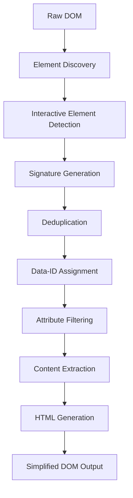

# DOM Extraction System

## Overview

The DOM Extraction System is responsible for analyzing web pages, simplifying complex DOM structures, and providing clean, actionable representations to the AI system. It intelligently identifies interactive elements, removes noise, and creates a streamlined view of page content that enables precise automation.

## Architecture

### Core Components

```typescript
interface LayerElement {
  id: string;
  tagName: string;
  attributes: Record<string, string>;
  textContent?: string;
  children: (LayerElement | null)[];
}

interface SimplificationConfig {
  attrs: string[];           // Attributes to preserve
  skip: string[];           // Elements to skip entirely
  interactiveOnly: boolean; // Focus on interactive elements
  maxDepth: number;         // Maximum DOM depth to process
}
```

### Extraction Pipeline



## Element Discovery and Processing

### Interactive Element Detection

```typescript
const isInteractiveElement = (el: Element, tag: string): boolean => {
  const role = el.getAttribute("role")?.toLowerCase();
  const type = el.getAttribute("type")?.toLowerCase();
  
  // Form elements
  if (["input", "textarea", "select", "button"].includes(tag)) {
    return true;
  }
  
  // Clickable elements
  if (tag === "a" || role === "button" || role === "link") {
    return true;
  }
  
  // Interactive ARIA roles
  const interactiveRoles = [
    "button", "link", "menuitem", "tab", "option", 
    "checkbox", "radio", "slider", "spinbutton",
    "textbox", "combobox", "listbox"
  ];
  if (interactiveRoles.includes(role || "")) {
    return true;
  }
  
  // Special cases
  if (el.hasAttribute("onclick") || el.hasAttribute("jsaction")) {
    return true;
  }
  
  // Dropdown detection
  if (isDropdown(el, tag)) {
    return true;
  }
  
  return false;
};

const isDropdown = (el: Element, tag: string): boolean => {
  const role = el.getAttribute("role")?.toLowerCase();
  const type = el.getAttribute("type")?.toLowerCase();
  
  // Standard dropdown elements
  if (["select", "option", "optgroup"].includes(tag)) {
    return true;
  }
  
  // ARIA dropdown patterns
  if (["listbox", "combobox", "menu", "menuitem"].includes(role || "")) {
    return true;
  }
  
  // Input with combobox type
  if (tag === "input" && type === "combobox") {
    return true;
  }
  
  // Elements with dropdown indicators
  if (el.getAttribute("aria-haspopup") || 
      el.getAttribute("aria-expanded")) {
    return true;
  }
  
  // Class-based detection
  const dropdownClasses = ["dropdown", "select", "combobox", "menu"];
  return dropdownClasses.some(cls => el.classList.contains(cls));
};
```

### Element Signature Generation

```typescript
const getElementSignature = (el: Element, tagName: string): string => {
  const significantAttrs = [
    "role", "type", "placeholder", "aria-label", 
    "aria-expanded", "title", "for", "contenteditable"
  ];
  
  const attrStr = significantAttrs
    .map(attr => `${attr}:${el.getAttribute(attr) || ""}`)
    .join("|");
  
  // Extract direct text content (not from children)
  const textContent = Array.from(el.childNodes)
    .filter(node => node.nodeType === Node.TEXT_NODE)
    .map(node => node.textContent)
    .join("")
    .trim();
  
  return `${tagName}|${attrStr}|${textContent}`;
};
```

### Deduplication Strategy

```typescript
export async function getSimplifiedDom(): Promise<string> {
  const allElements = await executeScript(() => {
    const elements: any[] = [];
    const processedElements = new Set<Element>();
    const elementSignatures = new Map<string, ElementData>();
    let idCounter = 0;
    
    Array.from(document.querySelectorAll("*")).forEach((el) => {
      const tagName = el.tagName.toLowerCase();
      
      // Skip non-interactive elements and already processed
      if (skipElements.includes(tagName) || processedElements.has(el)) {
        return;
      }
      
      const rect = el.getBoundingClientRect();
      const style = window.getComputedStyle(el);
      const isVisible = !(
        rect.width === 0 ||
        rect.height === 0 ||
        style.display === "none" ||
        style.visibility === "hidden" ||
        style.opacity === "0"
      );
      
      const isDropdownElement = isDropdown(el, tagName);
      
      // Include if visible or if it's a dropdown (even if hidden)
      if (isVisible || isDropdownElement) {
        processedElements.add(el);
        
        const signature = getElementSignature(el, tagName);
        const existing = elementSignatures.get(signature);
        
        // Prefer visible elements over invisible ones
        if (existing && existing.isVisible && !isVisible) {
          return; // Skip invisible duplicate
        }
        
        const cloned = el.cloneNode(false) as Element;
        cloned.setAttribute("data-id", idCounter.toString());
        
        // Mark invisible dropdowns
        if (isDropdownElement && !isVisible) {
          cloned.setAttribute("data-invisible-dropdown", "true");
        }
        
        // Extract direct text content
        const directText = Array.from(el.childNodes)
          .filter(node => node.nodeType === Node.TEXT_NODE)
          .map(node => node.textContent)
          .join("")
          .trim();
        
        if (directText) {
          cloned.textContent = directText;
        }
        
        const elementData = { 
          element: el, 
          isVisible, 
          cloned, 
          id: idCounter++ 
        };
        
        // Replace invisible element with visible one
        if (existing && !existing.isVisible && isVisible) {
          const index = elements.findIndex(item => item.id === existing.id);
          if (index !== -1) {
            elements.splice(index, 1);
          }
        }
        
        elementSignatures.set(signature, elementData);
        elements.push(elementData);
      }
    });
    
    // Store elements globally for debugging
    (window as any).__superwizard_elements = elements.map(item => item.element);
    
    // Create container with cloned elements
    const container = document.createElement("div");
    elements.forEach(item => container.appendChild(item.cloned));
    
    return container.innerHTML;
  });
  
  if (!allElements) return "No visible content available";
  
  return processExtractedElements(allElements);
}
```

## Content Processing

### Attribute Filtering

```typescript
const PRESERVED_ATTRIBUTES = [
  "data-id",
  "role",
  "type", 
  "placeholder",
  "aria-label",
  "aria-expanded",
  "title",
  "for",
  "contenteditable",
  "aria-labelledby",
  "value",
  "checked",
  "selected",
  "disabled"
];

const processElement = (e: Element): LayerElement | null => {
  const tag = e.tagName.toLowerCase();
  
  // Skip non-essential elements
  if (SKIP_ELEMENTS.includes(tag)) {
    return null;
  }
  
  // Filter and preserve important attributes
  const attrs: Record<string, string> = {};
  Array.from(e.attributes).forEach(attr => {
    if (PRESERVED_ATTRIBUTES.includes(attr.name.toLowerCase())) {
      attrs[attr.name] = attr.value;
    }
  });
  
  return {
    id: e.id || attrs["data-id"] || generateUniqueId(),
    tagName: tag,
    attributes: attrs,
    textContent: e.textContent?.trim() || undefined,
    children: [], // Flattened structure
  };
};
```

### HTML Generation

```typescript
const elementToHtml = (el: LayerElement): string => {
  // Skip hidden inputs without content
  if (el.tagName === "input" && 
      el.attributes["type"] === "hidden" && 
      !el.textContent) {
    return "";
  }
  
  const filteredAttrs = Object.entries(el.attributes).filter(
    ([k, v]) => PRESERVED_ATTRIBUTES.includes(k.toLowerCase()) && v
  );
  
  const dataIdAttr = filteredAttrs.find(([k]) => k === "data-id");
  const otherAttrs = filteredAttrs.filter(([k]) => k !== "data-id");
  
  // Filter out elements with only role attribute and no content
  if (!el.textContent && 
      otherAttrs.length === 1 && 
      otherAttrs[0][0] === "role") {
    return "";
  }
  
  // Skip elements with only data-id and no other meaningful content
  if (dataIdAttr && otherAttrs.length === 0 && !el.textContent) {
    return "";
  }
  
  const attrString = otherAttrs
    .map(([k, v]) => `${k}="${v}"`)
    .join(" ");
  
  const dataIdPrefix = dataIdAttr ? `${dataIdAttr[1]}` : "";
  
  const htmlElement = `${dataIdPrefix}<${el.tagName}${
    attrString ? ` ${attrString}` : ""
  }>${el.textContent || ""}</${el.tagName}>`;
  
  return htmlElement;
};
```

## Advanced Processing Features

### Form State Extraction

```typescript
const extractFormState = (element: Element): Record<string, any> => {
  const formData: Record<string, any> = {};
  
  if (element instanceof HTMLInputElement) {
    formData.value = element.value;
    formData.checked = element.checked;
    formData.disabled = element.disabled;
  } else if (element instanceof HTMLSelectElement) {
    formData.value = element.value;
    formData.selectedIndex = element.selectedIndex;
    formData.options = Array.from(element.options).map(opt => ({
      value: opt.value,
      text: opt.text,
      selected: opt.selected
    }));
  } else if (element instanceof HTMLTextAreaElement) {
    formData.value = element.value;
    formData.disabled = element.disabled;
  }
  
  return formData;
};
```

### Dynamic Content Detection

```typescript
const detectDynamicContent = (element: Element): boolean => {
  // Check for loading indicators
  const loadingIndicators = [
    "loading", "spinner", "skeleton", "placeholder"
  ];
  
  const hasLoadingClass = loadingIndicators.some(indicator =>
    element.className.toLowerCase().includes(indicator)
  );
  
  // Check for ARIA live regions
  const ariaLive = element.getAttribute("aria-live");
  const ariaBusy = element.getAttribute("aria-busy") === "true";
  
  // Check for pending network requests
  const hasPendingRequests = (window as any).fetch?.pending || 
                            (window as any).XMLHttpRequest?.active;
  
  return hasLoadingClass || !!ariaLive || ariaBusy || hasPendingRequests;
};
```

### Content Prioritization

```typescript
const prioritizeElements = (elements: LayerElement[]): LayerElement[] => {
  return elements.sort((a, b) => {
    // Primary form elements get highest priority
    const primaryElements = ["input", "button", "select", "textarea"];
    const aIsPrimary = primaryElements.includes(a.tagName);
    const bIsPrimary = primaryElements.includes(b.tagName);
    
    if (aIsPrimary && !bIsPrimary) return -1;
    if (!aIsPrimary && bIsPrimary) return 1;
    
    // Elements with text content get higher priority
    const aHasText = !!a.textContent?.trim();
    const bHasText = !!b.textContent?.trim();
    
    if (aHasText && !bHasText) return -1;
    if (!aHasText && bHasText) return 1;
    
    // Elements with meaningful attributes get priority
    const meaningfulAttrs = ["aria-label", "placeholder", "title"];
    const aHasMeaningful = meaningfulAttrs.some(attr => a.attributes[attr]);
    const bHasMeaningful = meaningfulAttrs.some(attr => b.attributes[attr]);
    
    if (aHasMeaningful && !bHasMeaningful) return -1;
    if (!aHasMeaningful && bHasMeaningful) return 1;
    
    return 0;
  });
};
```

## Performance Optimization

### Efficient DOM Traversal

```typescript
const optimizedTraversal = (root: Element): Element[] => {
  const result: Element[] = [];
  const stack: Element[] = [root];
  const maxElements = 1000; // Prevent memory issues
  
  while (stack.length > 0 && result.length < maxElements) {
    const current = stack.pop()!;
    
    if (isInteractiveElement(current, current.tagName.toLowerCase())) {
      result.push(current);
    }
    
    // Add children to stack (reverse order for depth-first)
    const children = Array.from(current.children).reverse();
    stack.push(...children);
  }
  
  return result;
};
```

### Memory Management

```typescript
const cleanupExtraction = (): void => {
  // Clear global element references
  delete (window as any).__superwizard_elements;
  
  // Clear any cached DOM queries
  if ((window as any).__superwizard_cache) {
    (window as any).__superwizard_cache.clear();
  }
  
  // Force garbage collection hint
  if ((window as any).gc) {
    (window as any).gc();
  }
};
```

### Caching Strategy

```typescript
class DOMExtractionCache {
  private cache = new Map<string, { data: string; timestamp: number }>();
  private readonly TTL = 5000; // 5 seconds
  
  get(key: string): string | null {
    const entry = this.cache.get(key);
    if (!entry) return null;
    
    if (Date.now() - entry.timestamp > this.TTL) {
      this.cache.delete(key);
      return null;
    }
    
    return entry.data;
  }
  
  set(key: string, data: string): void {
    this.cache.set(key, { data, timestamp: Date.now() });
    
    // Cleanup old entries
    if (this.cache.size > 10) {
      const oldest = Array.from(this.cache.entries())
        .sort(([,a], [,b]) => a.timestamp - b.timestamp)[0];
      this.cache.delete(oldest[0]);
    }
  }
  
  generateKey(url: string, viewport: string): string {
    return `${url}:${viewport}`;
  }
}
```

## Error Handling

### Extraction Errors

```typescript
interface ExtractionError {
  type: 'dom_access' | 'parsing_error' | 'memory_limit' | 'timeout';
  message: string;
  recoverable: boolean;
}

const handleExtractionError = (error: Error): ExtractionError => {
  const message = error.message.toLowerCase();
  
  if (message.includes('permission') || message.includes('access')) {
    return {
      type: 'dom_access',
      message: 'Cannot access DOM - permission denied',
      recoverable: false
    };
  }
  
  if (message.includes('memory') || message.includes('limit')) {
    return {
      type: 'memory_limit',
      message: 'DOM too large - memory limit exceeded',
      recoverable: true
    };
  }
  
  if (message.includes('timeout')) {
    return {
      type: 'timeout',
      message: 'DOM extraction timed out',
      recoverable: true
    };
  }
  
  return {
    type: 'parsing_error',
    message: error.message,
    recoverable: true
  };
};
```

### Fallback Strategies

```typescript
const extractWithFallback = async (): Promise<string> => {
  try {
    // Primary extraction method
    return await getSimplifiedDom();
  } catch (error) {
    const extractionError = handleExtractionError(error as Error);
    
    if (!extractionError.recoverable) {
      throw error;
    }
    
    try {
      // Fallback: Basic extraction
      return await getBasicDom();
    } catch (fallbackError) {
      // Last resort: Minimal extraction
      return await getMinimalDom();
    }
  }
};

const getBasicDom = async (): Promise<string> => {
  return executeScript(() => {
    const interactiveElements = document.querySelectorAll(
      'input, button, select, textarea, a[href], [role="button"]'
    );
    
    return Array.from(interactiveElements)
      .slice(0, 50) // Limit to prevent memory issues
      .map((el, index) => {
        const tag = el.tagName.toLowerCase();
        const text = el.textContent?.trim() || '';
        const placeholder = el.getAttribute('placeholder') || '';
        const ariaLabel = el.getAttribute('aria-label') || '';
        
        return `${index}<${tag}>${text || placeholder || ariaLabel}</${tag}>`;
      })
      .join('\n');
  });
};
```

## Integration Points

### With Task Manager
- Provides current page state for AI analysis
- Coordinates with page stability checks
- Supports task progress validation

### With Operations System
- Ensures element availability before actions
- Provides element metadata for action execution
- Coordinates data-id assignment

### With AI System
- Formats DOM data for AI consumption
- Provides context for action planning
- Supports screenshot integration

### With Visual Feedback
- Coordinates with cursor positioning
- Provides element bounds for highlighting
- Supports visual debugging

## Configuration Options

### Extraction Settings

```typescript
interface ExtractionConfig {
  maxElements: number;        // Maximum elements to process
  includeHidden: boolean;     // Include hidden interactive elements
  preserveStructure: boolean; // Maintain parent-child relationships
  enableCaching: boolean;     // Cache extraction results
  timeout: number;           // Maximum extraction time (ms)
  prioritizeVisible: boolean; // Prefer visible elements
}

const DEFAULT_CONFIG: ExtractionConfig = {
  maxElements: 500,
  includeHidden: true,
  preserveStructure: false,
  enableCaching: true,
  timeout: 10000,
  prioritizeVisible: true
};
```

### Site-Specific Optimizations

```typescript
const SITE_CONFIGS: Record<string, Partial<ExtractionConfig>> = {
  'gmail.com': {
    maxElements: 200,
    includeHidden: false,
    timeout: 15000
  },
  'amazon.com': {
    maxElements: 300,
    prioritizeVisible: true
  },
  'github.com': {
    preserveStructure: true,
    maxElements: 400
  }
};

const getSiteConfig = (url: string): ExtractionConfig => {
  const domain = new URL(url).hostname;
  const siteConfig = SITE_CONFIGS[domain] || {};
  
  return { ...DEFAULT_CONFIG, ...siteConfig };
};
```

## Future Enhancements

### Planned Features
1. **Semantic Analysis**: Understanding element purpose and context
2. **Layout Awareness**: Spatial relationship detection
3. **Change Detection**: Incremental DOM updates
4. **Shadow DOM Support**: Full shadow DOM traversal
5. **Performance Profiling**: Extraction performance analytics

### Advanced Capabilities
1. **ML-Based Classification**: AI-powered element categorization
2. **Accessibility Integration**: Screen reader compatibility
3. **Multi-Frame Support**: Cross-frame element detection
4. **Real-Time Updates**: Live DOM change streaming
5. **Custom Selectors**: User-defined extraction rules

This DOM Extraction System provides intelligent, efficient page analysis that enables precise automation while maintaining performance and reliability across diverse web applications.