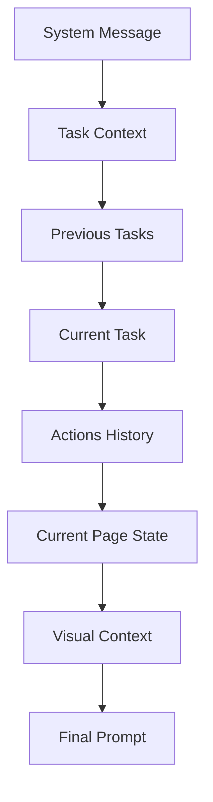

# Prompt Engineering System

## Overview

The Prompt Engineering System is responsible for constructing sophisticated, context-aware prompts that enable reliable browser automation through structured reasoning. It combines system instructions, current page state, action history, and visual context to create prompts that guide AI models to make accurate automation decisions.

## Architecture

### Core Components

```typescript
interface PromptContext {
  taskInstructions: string;
  previousActions: ActionWithThought[];
  pageContents: string;
  fullHistory: TaskHistoryEntry[];
  screenshotDataUrl?: string;
}

interface ActionWithThought {
  thought: string;
  action: string;
  parsedAction: AIActionPayload;
}

interface MessageGroup {
  message: string;
  actions: ActionWithThought[];
}
```

### Prompt Structure



## System Message Architecture

### Core Instructions

```typescript
export const systemMessage = `
You are Superwizard, a browser automation AI agent that helps users perform actions on websites.

Available Action Tools:
${formattedTools}

## CORE RULE: CURRENT PAGE ONLY
🚨 ALWAYS base element identification on CURRENT page contents provided in the prompt. NEVER use previous steps/memory for element IDs.

## RESPONSE FORMAT (MANDATORY)
🚨 CRITICAL: NEVER use XML-style closing tags like this INCORRECT format:
</thought>{chain_of_thought_reasoning}</thought>
</action>{action}</action>

ALWAYS use ONLY this exact format:
<thought>{chain_of_thought_reasoning}</thought>
<action>{action}</action>
`;
```

### Chain-of-Thought Structure

The system enforces a specific reasoning pattern for maximum accuracy:

```typescript
const THOUGHT_STRUCTURE = `
## THOUGHT STRUCTURE (CHAIN-OF-THOUGHT FORMAT)
Use this exact structure for maximum accuracy:

<thought>Ok, so let's see. The user asked me to do: "[user_query]". Based on the Current Actions History, I have done: [very brief summary, or "nothing yet" if empty]. Now let me analyze the current DOM state to understand what has actually been accomplished: [analyze current values, states, or content that indicate progress]. Hmm, Given the user's task and what the DOM state reveals about actual progress, I think I should: [proposed next step based on REAL current state]. Now Let's see, looking at the current page contents provided, I can identify the target strictly from the CURRENT DOM: [quote exact attributes such as id=123, aria-label="Search", role, text]. [If needed: MEMORY: store important information here]</thought>

### Key Components (ALL REQUIRED):
1. **User Query Acknowledgment**: Always start with "The user asked me to do: [user_query]"
2. **Progress Summary**: "Based on the Current Actions History, I have done: [summary or 'nothing yet']"
3. **DOM State Analysis**: "Now let me analyze the current DOM state to understand what has actually been accomplished: [analyze current values/states]"
4. **Next Step Planning**: "Given the user's task and what the DOM state reveals about actual progress, I think I should: [next action based on REAL current state]"
5. **Current DOM Validation**: "Looking at the current page contents provided, I can identify the target strictly from the CURRENT DOM: [exact attributes]"
6. **Memory Storage** (optional): "MEMORY: [important context]" when needed
`;
```

### Action Specifications

```typescript
const ACTION_SPECIFICATIONS = `
## KEY ACTIONS & FORMATTING

### Enter Key Logic :
Use "\\n" (to enter) (MANDATORY):
- Search boxes: to trigger search/submit
- Chat applications: to send messages (ONLY at the end of the message)
- Form submissions: when input field requires enter to submit
- NEVER use more than 1 "\\n" in a single action

Use "\\r" (to newlines) (MANDATORY):
- New lines within text (line breaks)
- Rich text editors: soft line breaks
- Textarea elements: inserting newlines at cursor position
- Chat applications: line breaks within messages (before sending)
- For multi-paragraph text: insert "\\r\\r" (maximum 2 times only) between paragraphs to separate them clearly
- NEVER use more than 2 "\\r" in a single action

### FORBIDDEN PATTERNS (NEVER USE):
- ❌ "\\r\\n\\n" - Multiple enters after newlines
- ❌ "\\r\\n\\r" - Newline after enter
- ❌ "\\n\\n" - Multiple enters
- ❌ "\\r\\r\\r" - More than 2 newlines
- ❌ "\\n\\r" - Enter followed by newline
- ❌ Any combination exceeding 1 "\\n" or 2 "\\r"
`;
```

## Prompt Construction Pipeline

### 1. Message Grouping

```typescript
function buildMessageGroups(
  taskInstructions: string,
  previousActions: ActionWithThought[],
  fullHistory: TaskHistoryEntry[]
): MessageGroup[] {
  const groups: MessageGroup[] = [];
  
  // Add previous user messages from history
  if (fullHistory?.length > 0) {
    fullHistory
      .filter((entry) => entry.prompt && !entry.content)
      .forEach((entry) => {
        if (entry.prompt !== taskInstructions) {
          groups.push({ message: entry.prompt, actions: [] });
        }
      });
  }
  
  // Add or update current task
  const existingIndex = groups.findIndex((g) => g.message === taskInstructions);
  if (existingIndex !== -1) {
    groups[existingIndex].actions = previousActions;
  } else {
    groups.push({ message: taskInstructions, actions: previousActions });
  }
  
  return groups;
}
```

### 2. Task Prioritization

```typescript
function findCurrentTaskIndex(
  groups: MessageGroup[],
  taskInstructions: string
): number {
  // Find the current task (should be last occurrence)
  for (let i = groups.length - 1; i >= 0; i--) {
    if (groups[i].message === taskInstructions) return i;
  }
  return groups.length - 1;
}

function formatPromptContent(
  groups: MessageGroup[],
  currentTaskIndex: number
): string {
  let content = "";
  let globalStepId = 1;
  
  groups.forEach((group, idx) => {
    const isCurrent = idx === currentTaskIndex;
    const showFullHistory = isCurrent || idx === currentTaskIndex - 1;
    const priority = isCurrent
      ? "(Current Task, High Priority)"
      : "(Previous Task, Low Priority)";
    
    // User prompt section
    content += `\n# User Prompt ${idx + 1} ${priority}:\n<user_query>${
      group.message
    }</user_query>\n\n`;
    
    // Actions history section
    content += "## Actions History:\n";
    if (group.actions.length > 0) {
      group.actions.forEach((action) => {
        content += `<step>${globalStepId}</step>\n`;
        if (showFullHistory) {
          content += `<thought>${action.thought}</thought>\n`;
        }
        content += `<action>${action.action}</action>\n`;
        globalStepId++;
      });
      content += "\n";
    } else {
      content +=
        "- No previous actions for this task yet. Begin with first action.\n\n";
    }
  });
  
  return content;
}
```

### 3. Context Section Building

```typescript
async function buildContextSection(
  screenshotDataUrl?: string,
  pageContents?: string
): Promise<string> {
  const taskTab = await getTaskTab();
  let context = `- Current Time: ${new Date().toLocaleString()}\n`;
  context += `- Page URL: ${taskTab?.url || "No URL available"}\n\n`;
  
  // Screenshot context (if available)
  if (screenshotDataUrl) {
    context += `# Page Screenshot (data URL preview):\n${screenshotDataUrl.slice(
      0,
      256
    )}...[truncated]\n\n`;
  }
  
  // DOM content
  context += `# Page Contents:\n${pageContents}`;
  return context;
}
```

## Advanced Prompt Features

### Website-Specific Rules

```typescript
const WEBSITE_RULES = `
## WEBSITE-SPECIFIC RULES

### Amazon.com:
- Never use price filter inputs (min/max price, "Go" button)
- Include price range in search query: "laptop $500-$1000"

### WhatsApp Web:
- Never press Enter when searching contacts
- Click last visible chat to load more contacts (don't search)
- Wait 10 seconds if no chats visible

### Google Flights:
- Use click-type-select pattern for location inputs
- Sequence: click(input) -> setValue(input, "text") -> click(dropdown_option)
- Only setValue() when aria-expanded="true" and aria-label="Where else?"
- After clicking "Done", always click the "Search" button to proceed

### Gmail (mail.google.com):
- Recipients: <input aria-label="To recipients" type="text" role="combobox">
- Subject: <input placeholder="Subject" aria-label="Subject">
- Body: <div aria-label="Message Body" role="textbox" contenteditable="true">

### github.com:
- To perform a search, always use navigate action
- URL format: https://github.com/search?q=YOUR_QUERY
- Replace YOUR_QUERY with search terms, using + to separate words
`;
```

### Error Prevention Patterns

```typescript
const ERROR_PREVENTION = `
## CRITICAL REMINDERS
- ONE response = ONE step only
- NO text outside required tags (thought and Action tags only)
- Use EXACT Chain-of-Thought format: "Ok, so let's see. The user asked me to do: ..." 
- ALWAYS analyze DOM state to understand real progress (input values, page content, button states)
- Current page contents ONLY for element identification
- Verify element exists before every action
- Never reference previous step elements
- Quote exact DOM attributes in thoughts (id, aria-label, role, text)
- DOM state reveals truth - never hallucinate progress
- For repeat tasks: use DOM state to determine sequence position
- After completing a task, you MUST call finish() and MUST NOT start the sequence again
`;
```

### Example Patterns

```typescript
const EXAMPLE_PATTERNS = `
## EXAMPLES

**Navigation:**
<thought>Ok, so let's see. The user asked me to do: "Navigate to example.com". Based on the Current Actions History, I have done: nothing yet. Now let me analyze the current DOM state to understand what has actually been accomplished: I can see the current URL and page content to understand where I am now. Hmm, Given the user's task and what the DOM state reveals about actual progress, I think I should: navigate to the target website since the current state shows I'm not yet at example.com. Now Let's see, looking at the current page contents provided, I can identify that I need to navigate to https://example.com.</thought>
<action>navigate("https://example.com")</action>

**Search with existing content:**
<thought>Ok, so let's see. The user asked me to do: "Search for laptop". Based on the Current Actions History, I have done: navigated to the website. Now let me analyze the current DOM state to understand what has actually been accomplished: the search input contains "smartphone" which means a previous search was executed. Hmm, Given the user's task and what the DOM state reveals about actual progress, I think I should: clear the existing search and enter "laptop" since the current state shows "smartphone" not "laptop". Now Let's see, looking at the current page contents provided, I can identify the target strictly from the CURRENT DOM: id="789", aria-label="Search", currently containing "smartphone".</thought>
<action>setValue(789, "laptop\\n")</action>
`;
```

## Context Management

### Memory System

```typescript
interface TaskMemory {
  key: string;
  value: any;
  timestamp: number;
  expiresAt?: number;
}

class PromptMemoryManager {
  private memory: Map<string, TaskMemory> = new Map();
  
  store(key: string, value: any, ttl?: number): void {
    const memory: TaskMemory = {
      key,
      value,
      timestamp: Date.now(),
      expiresAt: ttl ? Date.now() + ttl : undefined
    };
    
    this.memory.set(key, memory);
  }
  
  retrieve(key: string): any {
    const memory = this.memory.get(key);
    if (!memory) return null;
    
    if (memory.expiresAt && Date.now() > memory.expiresAt) {
      this.memory.delete(key);
      return null;
    }
    
    return memory.value;
  }
  
  formatForPrompt(): string {
    const activeMemories = Array.from(this.memory.values())
      .filter(m => !m.expiresAt || Date.now() < m.expiresAt)
      .slice(-5); // Keep only recent memories
    
    if (activeMemories.length === 0) return "";
    
    return "\n## Stored Memory:\n" + 
           activeMemories.map(m => `- ${m.key}: ${m.value}`).join("\n") + 
           "\n";
  }
}
```

### Context Window Management

```typescript
class ContextWindowManager {
  private maxTokens: number;
  
  constructor(maxTokens: number = 4000) {
    this.maxTokens = maxTokens;
  }
  
  optimizePrompt(prompt: string): string {
    const estimatedTokens = this.estimateTokens(prompt);
    
    if (estimatedTokens <= this.maxTokens) {
      return prompt;
    }
    
    // Truncation strategy
    return this.truncatePrompt(prompt, this.maxTokens);
  }
  
  private estimateTokens(text: string): number {
    // Rough estimation: 1 token ≈ 4 characters
    return Math.ceil(text.length / 4);
  }
  
  private truncatePrompt(prompt: string, maxTokens: number): string {
    const sections = this.parsePromptSections(prompt);
    const maxChars = maxTokens * 4;
    
    // Priority order: System > Current Task > Recent Actions > Context
    let result = sections.system;
    let remainingChars = maxChars - result.length;
    
    if (remainingChars > 0 && sections.currentTask) {
      const taskSection = sections.currentTask.slice(0, remainingChars);
      result += taskSection;
      remainingChars -= taskSection.length;
    }
    
    if (remainingChars > 0 && sections.recentActions) {
      const actionsSection = sections.recentActions.slice(0, remainingChars);
      result += actionsSection;
      remainingChars -= actionsSection.length;
    }
    
    if (remainingChars > 0 && sections.context) {
      const contextSection = sections.context.slice(0, remainingChars);
      result += contextSection;
    }
    
    return result;
  }
  
  private parsePromptSections(prompt: string): {
    system: string;
    currentTask: string;
    recentActions: string;
    context: string;
  } {
    // Implementation to parse prompt into sections
    // This would identify different parts of the prompt for intelligent truncation
    return {
      system: "",
      currentTask: "",
      recentActions: "",
      context: ""
    };
  }
}
```

## Visual Context Integration

### Screenshot Processing

```typescript
interface ScreenshotContext {
  dataUrl: string;
  timestamp: string;
  annotations?: ElementAnnotation[];
}

interface ElementAnnotation {
  elementId: number;
  bounds: { x: number; y: number; width: number; height: number };
  label: string;
}

class VisualContextProcessor {
  processScreenshot(
    screenshotDataUrl: string,
    domElements: LayerElement[]
  ): ScreenshotContext {
    return {
      dataUrl: screenshotDataUrl,
      timestamp: new Date().toISOString(),
      annotations: this.generateAnnotations(domElements)
    };
  }
  
  private generateAnnotations(elements: LayerElement[]): ElementAnnotation[] {
    // Generate visual annotations for key elements
    return elements
      .filter(el => el.attributes['data-id'])
      .map(el => ({
        elementId: parseInt(el.attributes['data-id']),
        bounds: this.getElementBounds(el),
        label: this.generateElementLabel(el)
      }));
  }
  
  private generateElementLabel(element: LayerElement): string {
    const label = element.attributes['aria-label'] || 
                  element.attributes['placeholder'] ||
                  element.textContent ||
                  element.tagName;
    
    return label.slice(0, 50); // Truncate long labels
  }
  
  formatForPrompt(context: ScreenshotContext): string {
    let prompt = `# Visual Context\n`;
    prompt += `Screenshot captured at: ${context.timestamp}\n`;
    
    if (context.annotations && context.annotations.length > 0) {
      prompt += `\n## Visible Interactive Elements:\n`;
      context.annotations.forEach(annotation => {
        prompt += `- Element ${annotation.elementId}: ${annotation.label} at (${annotation.bounds.x}, ${annotation.bounds.y})\n`;
      });
    }
    
    return prompt;
  }
}
```

## Quality Assurance

### Prompt Validation

```typescript
class PromptValidator {
  validate(prompt: string): ValidationResult {
    const issues: string[] = [];
    
    // Check for required sections
    if (!prompt.includes('# User Prompt')) {
      issues.push('Missing user prompt section');
    }
    
    if (!prompt.includes('# Page Contents')) {
      issues.push('Missing page contents section');
    }
    
    // Check for proper formatting
    if (!this.hasProperThoughtStructure(prompt)) {
      issues.push('Improper thought structure in examples');
    }
    
    // Check token limits
    const estimatedTokens = this.estimateTokens(prompt);
    if (estimatedTokens > 8000) {
      issues.push(`Prompt too long: ${estimatedTokens} tokens`);
    }
    
    return {
      isValid: issues.length === 0,
      issues,
      tokenCount: estimatedTokens
    };
  }
  
  private hasProperThoughtStructure(prompt: string): boolean {
    const thoughtPattern = /Ok, so let's see\. The user asked me to do:/;
    return thoughtPattern.test(prompt);
  }
  
  private estimateTokens(text: string): number {
    return Math.ceil(text.length / 4);
  }
}

interface ValidationResult {
  isValid: boolean;
  issues: string[];
  tokenCount: number;
}
```

### A/B Testing Framework

```typescript
class PromptExperimentManager {
  private experiments: Map<string, PromptExperiment> = new Map();
  
  createExperiment(
    name: string,
    controlPrompt: string,
    variantPrompts: string[]
  ): void {
    this.experiments.set(name, {
      name,
      controlPrompt,
      variantPrompts,
      results: [],
      startTime: Date.now()
    });
  }
  
  getPromptForUser(experimentName: string, userId: string): string {
    const experiment = this.experiments.get(experimentName);
    if (!experiment) return experiment?.controlPrompt || '';
    
    // Simple hash-based assignment
    const hash = this.hashUserId(userId);
    const variantIndex = hash % (experiment.variantPrompts.length + 1);
    
    if (variantIndex === 0) {
      return experiment.controlPrompt;
    } else {
      return experiment.variantPrompts[variantIndex - 1];
    }
  }
  
  recordResult(
    experimentName: string,
    userId: string,
    success: boolean,
    metrics: Record<string, number>
  ): void {
    const experiment = this.experiments.get(experimentName);
    if (!experiment) return;
    
    experiment.results.push({
      userId,
      success,
      metrics,
      timestamp: Date.now()
    });
  }
  
  private hashUserId(userId: string): number {
    let hash = 0;
    for (let i = 0; i < userId.length; i++) {
      const char = userId.charCodeAt(i);
      hash = ((hash << 5) - hash) + char;
      hash = hash & hash; // Convert to 32-bit integer
    }
    return Math.abs(hash);
  }
}

interface PromptExperiment {
  name: string;
  controlPrompt: string;
  variantPrompts: string[];
  results: ExperimentResult[];
  startTime: number;
}

interface ExperimentResult {
  userId: string;
  success: boolean;
  metrics: Record<string, number>;
  timestamp: number;
}
```

## Performance Optimization

### Prompt Caching

```typescript
class PromptCache {
  private cache = new Map<string, CachedPrompt>();
  private readonly maxSize = 100;
  private readonly ttl = 5 * 60 * 1000; // 5 minutes
  
  get(key: string): string | null {
    const cached = this.cache.get(key);
    if (!cached) return null;
    
    if (Date.now() - cached.timestamp > this.ttl) {
      this.cache.delete(key);
      return null;
    }
    
    cached.accessCount++;
    cached.lastAccess = Date.now();
    return cached.prompt;
  }
  
  set(key: string, prompt: string): void {
    if (this.cache.size >= this.maxSize) {
      this.evictLeastUsed();
    }
    
    this.cache.set(key, {
      prompt,
      timestamp: Date.now(),
      lastAccess: Date.now(),
      accessCount: 1
    });
  }
  
  private evictLeastUsed(): void {
    let leastUsed: [string, CachedPrompt] | null = null;
    
    for (const [key, cached] of this.cache.entries()) {
      if (!leastUsed || cached.accessCount < leastUsed[1].accessCount) {
        leastUsed = [key, cached];
      }
    }
    
    if (leastUsed) {
      this.cache.delete(leastUsed[0]);
    }
  }
  
  generateKey(
    taskInstructions: string,
    pageUrl: string,
    actionCount: number
  ): string {
    const hash = this.simpleHash(taskInstructions + pageUrl + actionCount);
    return `prompt_${hash}`;
  }
  
  private simpleHash(str: string): string {
    let hash = 0;
    for (let i = 0; i < str.length; i++) {
      const char = str.charCodeAt(i);
      hash = ((hash << 5) - hash) + char;
      hash = hash & hash;
    }
    return Math.abs(hash).toString(36);
  }
}

interface CachedPrompt {
  prompt: string;
  timestamp: number;
  lastAccess: number;
  accessCount: number;
}
```

## Integration Points

### With AI Gateway
- Provides formatted prompts for AI requests
- Handles provider-specific formatting requirements
- Manages context window constraints

### With Task Manager
- Receives task context and history
- Formats progress and state information
- Coordinates with memory management

### With DOM Extraction
- Integrates current page state
- Formats element information for AI consumption
- Handles large DOM simplification

### With Visual Feedback
- Incorporates screenshot context
- Provides visual element annotations
- Supports multimodal AI interactions

## Future Enhancements

### Planned Features
1. **Dynamic Prompt Adaptation**: AI-powered prompt optimization
2. **Multi-Language Support**: Localized prompt templates
3. **Semantic Understanding**: Context-aware prompt generation
4. **Performance Analytics**: Prompt effectiveness metrics
5. **Custom Templates**: User-defined prompt patterns

### Advanced Capabilities
1. **Few-Shot Learning**: Dynamic example selection
2. **Chain-of-Thought Optimization**: Automated reasoning improvement
3. **Context Compression**: Intelligent information summarization
4. **Multi-Modal Integration**: Enhanced visual-text coordination
5. **Adaptive Complexity**: Task-specific prompt sophistication

This Prompt Engineering System provides the foundation for reliable AI-driven automation through sophisticated context management, structured reasoning, and adaptive prompt generation.