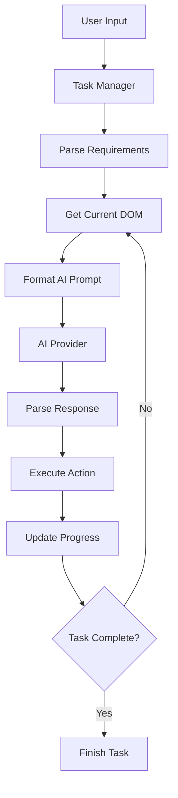

# Superwizard AI - Web Automation Chrome Extension

<div align="center">


**A powerful Chrome extension that executes DOM actions to fulfill natural language commands on any website**

[](https://chrome.google.com/webstore)
[](LICENSE)
[](https://www.typescriptlang.org/)
[](https://reactjs.org/)

</div>

## 🚀 Overview

Superwizard AI is an intelligent Chrome extension that transforms natural language commands into automated browser actions. It uses advanced AI to understand user intent and execute complex web automation tasks across any website.

### Key Features

- **Natural Language Processing**: Execute tasks using plain English commands
- **Multi-Provider AI Support**: Works with OpenAI, Anthropic, OpenRouter, and other AI providers
- **Real-time DOM Interaction**: Clicks, types, navigates, and waits with visual feedback
- **Side Panel Interface**: Clean, modern UI accessible via keyboard shortcut (Ctrl+K)
- **Omnibox Integration**: Quick commands via Chrome's address bar
- **Visual Cursor**: See exactly what the AI is doing with a custom cursor
- **Cross-Website Compatibility**: Works on any website (except Chrome system pages)
- **Developer View**: Detailed logs and action history for debugging

## 🏗️ Architecture

### Core Components

#### 1. **Extension Structure**
```
src/
├── manifest.json          # Chrome extension configuration
├── App.tsx               # Main React application entry
├── interface/            # UI components and layouts
├── state/               # Zustand state management
├── wizardry/            # Core automation engine
├── pages/               # Extension pages (Background, Content, Sidepanel)
└── assets/              # Images, fonts, and static resources
```

#### 2. **State Management**
- **Zustand Store**: Centralized state with persistence
- **TaskManager**: Handles automation task execution and progress
- **Settings**: Manages AI providers, UI preferences, and user configuration

#### 3. **AI Integration**
- **Multi-Provider Support**: OpenAI, Anthropic, OpenRouter, and custom providers
- **System Gateway**: Unified API for different AI services
- **Response Parsing**: Structured action extraction from AI responses
- **Prompt Engineering**: Sophisticated prompt formatting for reliable automation

#### 4. **DOM Automation Engine**
- **Action System**: Click, setValue, navigate, waiting operations
- **Element Identification**: Data-id based element targeting
- **Stability Management**: Ensures page stability before actions
- **Error Handling**: Robust failure recovery and retry logic

## 🔧 How It Works

### 1. **Command Processing Flow**



### 2. **AI Action System**

The extension supports these core actions:

| Action | Description | Example |
|--------|-------------|---------|
| `click(elementId)` | Click on an element | `click(123)` |
| `setValue(elementId, "text")` | Type text into input | `setValue(456, "search term\n")` |
| `navigate("url")` | Navigate to URL | `navigate("https://example.com")` |
| `waiting(seconds)` | Wait for specified time | `waiting(5)` |
| `finish()` | Complete task successfully | `finish()` |
| `fail("message")` | Report task failure | `fail("Element not found")` |
| `respond("message")` | Send response to user | `respond("Found 5 products")` |

### 3. **Element Identification**

The extension uses a sophisticated element identification system:

- **Data-id Attributes**: Primary method for element targeting
- **Aria Labels**: Accessibility-focused identification
- **Text Content**: Fallback for element selection
- **DOM Structure**: Context-aware element selection

### 4. **AI Prompt Engineering**

The system uses carefully crafted prompts that include:

- **Current DOM State**: Simplified page structure
- **Previous Actions**: Context from previous steps
- **Task Instructions**: User's original request
- **Available Actions**: List of possible operations
- **Critical Rules**: Domain-specific automation rules

## 🎯 Key Features Explained

### 1. **Multi-Provider AI Support**

```typescript
// Supports multiple AI providers
const providers = {
  openai: { baseURL: "https://api.openai.com/v1", models: ["gpt-4", "gpt-3.5-turbo"] },
  anthropic: { baseURL: "https://api.anthropic.com", models: ["claude-3-opus", "claude-3-sonnet"] },
  openrouter: { baseURL: "https://openrouter.ai/api/v1", models: ["anthropic/claude-3-opus"] }
};
```

### 2. **Visual Feedback System**

- **Custom Cursor**: Shows exactly where the AI is clicking
- **Real-time Updates**: Live progress indication
- **Action History**: Detailed logs of all operations
- **Error Visualization**: Clear indication of failures

### 3. **Smart Navigation Handling**

```typescript
// Automatically handles restricted URLs
if (isRestrictedUrl) {
  await chrome.tabs.update(tabId, { url: "https://www.google.com" });
  // Wait for navigation completion
  await ensurePageStability(tabId);
}
```

### 4. **Robust Error Recovery**

- **Consecutive Failure Tracking**: Stops after 3 consecutive failures
- **Page Stability Checks**: Ensures DOM is ready before actions
- **Retry Logic**: Automatic retry with exponential backoff
- **Graceful Degradation**: Continues with partial success

## 🚀 Getting Started

### Installation

1. **Chrome Web Store** (Recommended)
   - Visit the Chrome Web Store
   - Click "Add to Chrome"
   - Extension will be installed automatically

2. **Manual Installation** (Development)
   ```bash
   git clone https://github.com/amirulhamizan12/superwizard-ai.git
   cd superwizard-ai
   yarn install
   yarn build
   ```
   - Open Chrome Extensions page (`chrome://extensions/`)
   - Enable "Developer mode"
   - Click "Load unpacked" and select the `dist` folder

### Initial Setup

1. **Open the Extension**
   - Click the Superwizard AI icon in Chrome toolbar
   - Or use keyboard shortcut: `Ctrl+K` (Windows/Linux) or `Cmd+K` (Mac)

2. **Configure AI Provider**
   - Click "Configure API" in the side panel
   - Add your API key for OpenAI, Anthropic, or OpenRouter
   - Select your preferred model

3. **Start Automating**
   - Type your command in natural language
   - Press Enter to execute
   - Watch the AI perform the task with visual feedback

## 📝 Usage Examples

### Basic Commands

```bash
# Navigate to a website
"Go to Amazon and search for laptops"

# Fill out a form
"Fill out the contact form with my name John Doe and email john@example.com"

# Extract information
"Find all product prices on this page and tell me the cheapest one"

# Complex workflows
"Log into my Gmail account, compose a new email to john@example.com with subject 'Meeting Tomorrow' and body 'Hi John, let's meet tomorrow at 2 PM'"
```

### Advanced Features

#### 1. **Omnibox Commands**
- Type `wiz` in Chrome's address bar
- Follow with your command
- Press Enter to execute

#### 2. **Website Integration**
```javascript
// Websites can trigger Superwizard commands
window.postMessage({
  type: "SUPERWIZARD_RUN_COMMAND",
  command: "Click the login button",
  source: "my-website"
}, "*");
```

#### 3. **Developer View**
- Switch to "Developer" view in settings
- See detailed action logs
- Debug automation issues
- Monitor AI responses

## 🔧 Configuration

### AI Provider Setup

#### OpenAI
```json
{
  "id": "openai",
  "name": "OpenAI",
  "apiKey": "your-api-key",
  "baseURL": "https://api.openai.com/v1",
  "models": ["gpt-4", "gpt-3.5-turbo"]
}
```

#### Anthropic
```json
{
  "id": "anthropic",
  "name": "Anthropic",
  "apiKey": "your-api-key",
  "baseURL": "https://api.anthropic.com",
  "models": ["claude-3-opus", "claude-3-sonnet"]
}
```

### Advanced Settings

- **Chat View Mode**: Switch between "Direct" and "Developer" views
- **Model Selection**: Choose different AI models for different tasks
- **Provider Management**: Add/remove AI providers as needed
- **API Key Security**: Secure storage of API credentials

## 🛠️ Development

### Prerequisites

- Node.js 18+ 
- Yarn package manager
- Chrome browser

### Development Setup

```bash
# Clone the repository
git clone https://github.com/amirulhamizan12/superwizard-ai.git
cd superwizard-ai

# Install dependencies
yarn install

# Start development server
yarn start

# Build for production
yarn build
```

### Project Structure

```
src/
├── wizardry/           # Core automation engine
│   ├── ai/            # AI integration and prompt engineering
│   ├── operation/     # DOM action execution
│   └── extraction/    # DOM simplification and parsing
├── interface/         # React UI components
├── state/            # Zustand state management
├── pages/            # Extension pages
│   ├── Background/   # Service worker
│   ├── Content/      # Content script
│   └── Sidepanel/    # Side panel UI
└── assets/           # Static resources
```

### Key Development Concepts

#### 1. **State Management**
```typescript
// Zustand store with persistence
const useAppState = create<StoreType>()(
  persist(
    immer(devtools((...a) => ({
      taskManager: createTaskManagerSlice(...a),
      settings: createSettingsSlice(...a),
    }))),
    {
      name: "app-state",
      storage: createJSONStorage(() => chromeStorage),
    }
  )
);
```

#### 2. **Action System**
```typescript
// Execute DOM actions with state tracking
export async function callDOMAction<T extends ActionName>(
  type: T,
  payload: ActionPayload<T>
): Promise<ActionResult> {
  // Action execution with error handling and state management
}
```

#### 3. **AI Integration**
```typescript
// Multi-provider AI gateway
export async function determineNextAction(
  taskInstructions: string,
  previousActions: Extract<ParsedResponse, { thought: string }>[],
  simplifiedDOM: string
): Promise<ActionResponse | null> {
  // Unified API for different AI providers
}
```

## 🔒 Security & Privacy

### Data Handling

- **Local Storage**: All settings and history stored locally
- **No Data Collection**: No user data sent to external servers
- **API Key Security**: Encrypted storage of API credentials
- **Privacy First**: No tracking or analytics

### Permissions

The extension requires these Chrome permissions:

- `tabs`: Access to browser tabs for automation
- `activeTab`: Current tab interaction
- `storage`: Local data persistence
- `scripting`: Content script injection
- `sidePanel`: Side panel functionality
- `host_permissions`: Website access for automation

## 🐛 Troubleshooting

### Common Issues

#### 1. **Extension Not Working**
- Check if API key is configured correctly
- Verify the selected AI model is available
- Ensure you're not on a restricted Chrome page

#### 2. **Actions Not Executing**
- Check if the target website allows automation
- Verify element identification (data-id attributes)
- Try refreshing the page and retrying

#### 3. **AI Provider Errors**
- Verify API key is valid and has sufficient credits
- Check if the selected model is available
- Ensure stable internet connection

### Debug Mode

Enable developer view to see:
- Detailed action logs
- AI response parsing
- DOM state changes
- Error messages and stack traces

## 🤝 Contributing

We welcome contributions! Please see our contributing guidelines:

1. Fork the repository
2. Create a feature branch
3. Make your changes
4. Add tests if applicable
5. Submit a pull request

### Development Guidelines

- Follow TypeScript best practices
- Use functional components with hooks
- Maintain consistent code style
- Add comprehensive error handling
- Document new features

## 📄 License

This project is licensed under the Apache 2.0 License - see the [LICENSE](LICENSE) file for details.

## 🙏 Acknowledgments

- **React Team**: For the amazing React framework
- **Zustand**: For lightweight state management
- **Chrome Extensions Team**: For the powerful extension APIs
- **OpenAI & Anthropic**: For providing excellent AI APIs

## 📞 Support

- **Email**: founder@superwizard.ai
- **GitHub Issues**: [Report bugs or request features](https://github.com/amirulhamizan12/superwizard-ai/issues)
- **Documentation**: [Full documentation](https://docs.superwizard.ai)

---

<div align="center">

**Made with ❤️ by Superwizard AI**

*Contribute to the project ~ amirul@superwizard.ai*

</div>
